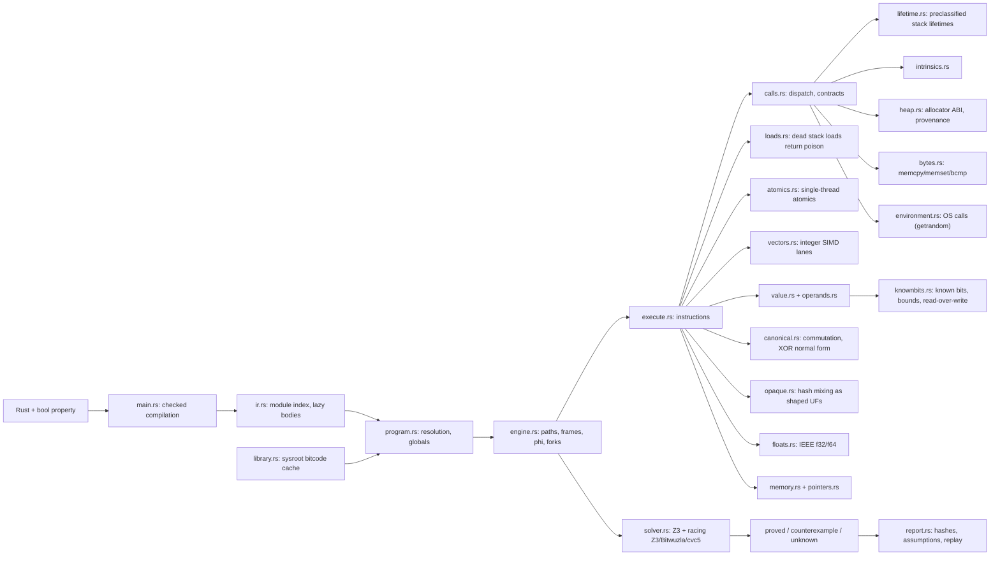

# Phage codebase map

Read this file first when maintaining Phage. Read [README.md](README.md)
for the short introduction and [docs/guide.md](docs/guide.md) for commands and result meanings. Phage owns its interpreter and path
exploration. rustc is its frontend; Z3 solves SMT queries. Kani and CBMC
are not called.

## Verification flow



## Ownership

| File | Owns | Invariants |
| --- | --- | --- |
| `src/main.rs` | CLI, compiler flags, target validation, exit codes, recorded assumptions | Overflow checks enabled; little endian x86_64 only; errors are unknown; `--queryTimeout` at most one day. |
| `src/layout.rs` | The target data layout the memory model assumes | A layout is accepted only when LLVM's ABI alignments for integers, floats, vectors, aggregates and address-space-0 pointers equal the model's implicit ones (rustc's x86_64 layout does); anything else is refused, never verified against wrong alignments. |
| `src/ir.rs` | Module index (defines with linkage, declares, noreturn, globals incl. mutable and thread-local, named types), lazy function bodies, `invoke` lowering | `invoke` becomes a call plus a branch to its normal label (a panic is already a reported failure, so the unwind edge never continues); parameter list follows `@name`; unlabeled entry block gets the next value number; `;` inside quotes is not a comment; indented top-level entities are refused; unparseable globals stay unavailable but still block resolution elsewhere; mutable ODR/weak/common globals are refused. |
| `src/constants.rs` | Initializers: strings, integers, `undef` parts, packed/natural/named structs, arrays, pointer relocations; type sizes with the module's named types | Exact bytes or rejection; `undef` and padding are uninitialized; relocations become stored pointers when allocated; a definition without `align` has its type's ABI alignment, never less. |
| `src/program.rs` | Function resolution across modules, lazy globals (a declaration resolves to the exported definition elsewhere) and code objects (weak declarations tracked), scoped `noreturn` | Private/internal definitions never resolve across modules; ambiguous library symbols are errors; cache keyed by (module, symbol); one object per global, keyed by its defining module; mutable globals record the fresh-program assumption; weak getrandom records link-time availability, other weak function addresses are unknown. |
| `src/library.rs` | Sysroot bitcode cache (`llvm-ar` → `llvm-objcopy .llvmbc` → `llvm-link` → `llvm-dis`), index of functions and global definitions | Keyed by index format, full rustc and LLVM versions, resolved compiler, sysroot and rlib SHA-256/metadata; manifest identity and every index/module SHA-256 are verified before use; staging is exclusively created; published by one atomic rename; duplicates usable only with ODR linkage. |
| `src/toolchain.rs`, `src/toolchain/tests.rs` | One concrete rustc executable, its metadata/host/sysroot, matching LLVM tools | Caller rustup selection resolves one absolute sysroot compiler before compilation; that identity drives compilation, reports, library/cache and replay; sysroot tools first, versioned PATH tools next, bare LLVM tools last; every candidate must report the same LLVM major. Failure names versions and the llvm-tools component fix. |
| `src/cache.rs`, `src/cache/tests.rs` | Cache manifest, SHA-256 and exclusive staging | Identity mismatch, changed/missing index/modules or invalid manifests are unknown. The module bytes hashed are the exact bytes parsed; a concurrent publisher is also checked. |
| `src/lifetime.rs` | Whole-stack lifetime classification and old/new marker execution | Only allocas referenced by lifetime.start begin dead; end-only allocas begin alive; a fixed point propagates same-module callee parameter effects (including recursion); unresolved association is unknown. Markers require stack provenance, offset zero, a live frame and a classified association, including caller allocas; poison has no effect, symbolic poison stays unknown; start resets bytes and separates live allocations. |
| `src/loads.rs` | Scalar/pointer/atomic loads and dispatch to vector loads | Dead allocated stack loads yield poison, with bounds/alignment still checked; noundef and observed poison are failures; freed heap and returned frames are invalid accesses. |
| `src/assume.rs`, `src/assume/tests.rs` | `llvm.assume` nonnull and ignore operand bundles | Each guarantee is a definedness/nonzero obligation, never a trusted path fact; null, poison and undef controls fail; `ignore` is a no-op even for poison/undef operands; other tags/signatures stay unknown. |
| `src/debug.rs` | Optional LLVM debug metadata and original Rust locations | Missing/cyclic metadata has no invented location; metadata never changes semantics. |
| `src/diagnostics.rs` | Stable result classes, reason codes, source positions and rustc/LLVM context for unrecognized IR/signatures only | Missing functions and resource limits stay distinct from application counterexamples. |
| `src/entry.rs`, `src/entry/tests.rs` | Reference-shaped entry ABI, exact slice bounds, initial byte witnesses | One unconstrained SMT byte array per fresh/disjoint noalias noundef reference; fixed extent from dereferenceable(N), slices require explicit maxSliceLen and adjacent named i64 length; exact lengths govern access; readonly/writeonly permissions are obligations; opaque LLVM pointers do not establish source element types. |
| `src/engine.rs`, `src/engine/state.rs` | DFS states, call frames, frame-local stack lifetimes, path forks, phi (globals and literal-address objects named by incomings are created first), block-visit bounds per call frame, verdicts | A feasible truncated or unsupported path prevents proof; no completed paths prevents proof; returning kills the callee's stack objects and restores the caller's visit counts. |
| `src/execute.rs` | Instruction dispatch: memory, GEP (sized and named element types), casts, bitcast, select, aggregates, switch, inttoptr | Unmodeled opcodes, flags and types are unknown; `nusw` alone is unsupported; omitted access alignment is the ABI alignment; a symbolic inttoptr has no provenance unless it is literally an exposed allocation's base plus an offset (`pointers.rs`); a load proved valid adds no pointer poison to its value. Pure inttoptr (integer zero-extension/truncation to pointer width), ptrtoint, pointer bitcast and poisoned GEP propagate poison; only observations fail. Comparison parsing and lazy undef operands live in `operands.rs`, keeping this dispatcher below 600 lines. |
| `src/calls.rs` | Call parsing (direct and indirect), divergence, parameter and result contracts, modeled and defined calls, `llvm.threadlocal.address` | `noreturn` calls end the path as counterexamples; `noundef`, `dereferenceable`, and with `noundef` also `nonnull`, `align`, `range` are obligations; a defined argument those attributes would poison without `noundef` is unknown for both defined calls and LLVM intrinsics (`attributePoison`; no inferred-attribute exemption; byte-intrinsic alignment is checked here for zero/possibly-zero lengths and by byte-range access for concrete nonzero lengths); violated result attributes of call sites and definitions poison the result; only llvm.assume nonnull bundles are supported; other bundles are unknown. Lifetime markers accept old (size, pointer) and new (pointer) forms for classified whole stack objects (caller frames included); end-only allocas begin alive; partial/non-base/unresolved cases stay unknown. Artifact-defined functions are executed regardless of panic-shaped names; name recognition is only for declarations resolved to sysroot bodies. |
| `src/atomics.rs` | `load/store atomic`, `atomicrmw`, `cmpxchg` (weak may fail spuriously), `fence` | One thread: orderings have no effect; old values must be initialized; omitted alignment is the value size; volatile and pointer read-modify-writes are unknown. |
| `src/vectors.rs` | Fixed-width integer vectors: load/store, lanewise ops and icmp, bitcast, insert/extract/shuffle, constants | Lanes carry their own poison; lane 0 is lowest address and least significant bit; constant indices only; out-of-range is poison. |
| `src/environment.rs` | OS calls std makes for the property: `getrandom` | Only for callees without a definition; each model records its environment assumption. |
| `src/intrinsics.rs` | Exact LangRef semantics of integer intrinsics | Poison flags honored; ctpop is a log-depth adder tree; unlisted intrinsics stay unknown. |
| `src/heap.rs`, `src/heap/alloc.rs` | Allocator ABI objects with exact bounded symbolic lengths, realloc, pointer store/load provenance, exact integer copies of pointers, dangling constants | Allocation assumed to succeed (recorded); layout (including alignment-rounded isize::MAX), liveness and zero size are obligations; a symbolic length keeps its exact term and a proved upper bound of at most 1 MiB; the upper bound never replaces access/layout bounds; symbolic reads resolve guarded shadow slots, splitting feasible choices; pointer loads re-prove their bytes, with solver unknown remaining unknown; an `i64` copy carries provenance only while its bits provably equal the stored pointer; ptrtoint explicitly carries its source provenance through an unchanged integer store/copy/inttoptr, while arithmetic loses it; realloc preserves exactly min(old length, new length) with guarded bytes/definedness and only whole guarded pointer slots; symbolic prefix copies above 4096 bytes stay unknown. |
| `src/bytes.rs` | memcpy/memmove/memset, bcmp/memcmp | A nonzero memcpy/memmove read of dead allocated stack storage is a counterexample: this model interprets LangRef's dead-stack load exception as applying to load instructions only (the diagnostic names this choice). Call-site argument attributes checked before zero-length no-op handling; memcpy ranges identical or disjoint; whole pointer slots move under source-containment guards, including symbolic offsets/lengths; writes invalidate old provenance under overlap guards; only specified results. Whole-object zero-offset copies reuse source arrays exactly on the accessible extent, retaining all obligations and guarded pointer/value shadows. Symbolic copy/fill/compare uses a proved finite byte-loop bound (at most 256) with exact per-byte guards. Prior array/order terms occur once, preventing exponential construction. |
| `src/operands.rs` | Operand evaluation, restricted global constant GEPs, comparisons, aggregates, materialization into hash-consed `define-fun`s (one per distinct simplified term) | Undef and poison are never silently defined values: `operand` observes while `transfer_operand` keeps undef through phi, store, select arms, aggregates, call arguments and returns. A pointer-undef comparison remains undef until exact `or true`/`and false` absorption; poison is never absorbed. Constant GEPs support only the documented byte/global/inbounds forms, with one-past and poison bounds preserved. |
| `src/value.rs` | Arithmetic, comparisons, definedness, aggregates, select | Signed division UB and poison rules per LangRef; `fully_defined` checks every aggregate leaf. |
| `src/pointers.rs` | Allocation addresses (base alignment registered as known bits), region separation, pointer choices, ptrtoint, exposed provenance, the no-provenance object, memory-array naming | Fresh entry objects never merge with other readonly objects. Fabricated integer-pointer objects reserve no memory and never add separation facts. Separation is imposed only for simultaneously live allocated objects: at allocation when initially alive and at lifetime.start; disjoint stack lifetimes may share an address; an unresolved choice forks the path; solver unknown stays unknown; only null has the empty object (comparisons fold it), a no-provenance pointer never folds and reaches no object; recovered provenance is unbounded (`bounded: false`), so every access is still bounds-checked; a counterexample model also lists the address chosen for each allocation the violated condition or the path names (`witness_model`, at most 16), since a misaligned access may fail only on some placements. |
| `src/memory.rs`, `src/memory/length.rs` | Exact concrete/symbolic lengths, bytes, per-byte initialization and poison arrays, alignment, lifetime, byte GEP, object kinds, store-to-load forwarding, guarded `PointerSlot` shadows | A load of exactly a whole value stored at a literal offset returns that term with identical definedness; every byte writer (store, memcpy/memset, realloc, lifetime) invalidates overlapping forwarded values. Shadow slots carry exact offsets and presence guards; address equality alone never creates provenance, and a new lifetime clears slots. Each access and inbounds GEP checks the exact length term, never the upper bound. Check access before load/store; dead allocated stack loads return poison, dead stores are UB; stack provenance and frame ownership are distinct from lifetime liveness; alignment is checked on the address (the offset alone when the object's alignment covers the access, else base plus offset, as after `align_offset`); no writes to constants or readonly entry objects, no reads through writeonly entry objects; one-past cannot be dereferenced; loads and stores go through `dereference`, so null or poison there is a counterexample; every array writer goes through `Object::set_flags`, which keeps never-poisoned and fully-initialized arrays literal so most definedness needs no query. |
| `src/partial.rs` | Per-byte definedness of integers read from memory (`Kind::Bytes`): stores, trunc/zext/sext, constant shifts and masks, select, bitcast; `select` over undef arms and undef choices (`Kind::UndefChoice`) | Undef bytes are undefined bit by bit; any poison byte poisons the whole value; flagged or non-constant operations keep the coarse (stricter) result. |
| `src/budget.rs` | Linux process-tree RSS sampling and available-memory default | Default min(8192 MiB, half MemAvailable), 1024 MiB fallback; sample between steps and solver waits with a 5 ms sampling interval. Exhaustion is unknown, never a pruned path. This soft budget can overshoot in one operation; use an OS cap for stress inputs. |
| `src/solver/transport.rs` | Solver process transport, deadline reads and cancellation recovery | Unknown/cancelled contexts restart with declarations replayed; SIGINT reuse requires a semantic push/check/pop round trip, not only echo. |
| `src/solver.rs` | Incremental Z3, standalone racers (fresh Z3, Bitwuzla, cvc5 int-blasting), profiling, logic switch to `ALL` on first floating-point use | First definite answer wins; the wait before racing adapts (halved when a racer wins, grown back when the incremental solver wins); a busy incremental solver is cancelled with SIGINT and kept only after a successful push/check/pop round trip, restarted and replayed only when that fails; racers are always reaped; unknown never becomes unsat; timeout diagnostics name milliseconds and query number; resource/cancellation outcomes remain distinct when Z3 identifies them. |
| `src/solver/slice.rs` | Allocation facts (nonzero, range, alignment, disjointness of base addresses) kept per query only for the bases the rest of the query mentions | Exact while every allocation is at most 2^32 bytes with alignment at most 2^12 and there are at most 2^20 objects (literal-address objects included): an unmentioned object can always be placed; past those bounds nothing is dropped; symbolic extents use proved upper bounds for the placement theorem and disable slicing if their length depends on addresses. |
| `src/floats.rs` | `float`/`double` as IEEE bits: arithmetic, `fcmp`, conversions (poison out of range, `.sat` saturating), `fneg`/`fabs`/`copysign` on bits, rounding and min/max intrinsics, `llvm.is.fpclass`, call and instruction `nnan`/`ninf` | Bit operations (bitcast, load/store, select, sign ops) are exact; a computed float is fresh bits whose FP reading is the result, rounding to nearest even; a computed NaN is quiet with any payload (a superset of LangRef's choices); opposite zeros in min/max are chosen per call; `frem`, other fast-math flags, other formats and float vectors are unknown. |
| `src/knownbits.rs`, `src/knownbits/rewrite.rs` | Known-zero/one bits and unsigned bounds of terms (LLVM KnownBits transfer functions) through `define-fun` bodies; rewrites every term before it is named: literals, decided comparisons and flag identities, Boolean folding, `select` over store chains; four deterministic String-keyed `BTreeMap` caches | Every rewrite is an equivalence on all values the path allows; facts are global, so only facts that hold on every path mentioning a symbol (allocation-base alignment) are assumed; tests check transfer functions exhaustively and rewrites against Z3, with mutation controls. Deterministic caches avoid random-hash paths and measured no material QUIC/HPACK regression. |
| `src/canonical.rs` | Operand order of commutative operators; XOR chains (and `or disjoint`) as a sorted leaf set plus one folded constant | Exact identities on defined values; per-byte values stay left of a constant mask. |
| `src/opaque.rs` | Values mixed from `getrandom` bytes (hash keys): taint, one uninterpreted function per interned computation shape over its leaves, exact definitions per path, witness confirmation | Abstract unsat is exact unsat; a counterexample is reported only after exact confirmation (concrete witness first, then the full exact query); per-byte definedness stays exact. |
| `src/symbols.rs` | v0 mangling paths (allocator and core/std panic namespaces), balanced parentheses | Paths outside plain nested namespaces are not interpreted. |
| `src/report.rs` | Run directory, schema 4 JSON (absolute compiler/sysroot and compiler fingerprint included), diagnostics, profiling and snapshot replay | Results refer to retained hashes; never overwrite runs; replay uses captured sources. |
| `src/*/tests.rs`, `src/heap/provenance_tests.rs`, `tests/round3.rs` | Semantic controls per subsystem (engine, intrinsics, heap/calls, solver, environment: statics, atomics, vectors, provenance, attributes); symbolic shadow reads, stores, copies, fills and reallocations | Real Z3 required; every fix from review has a regression that fails on the old code; corrupt/partial/unprovenanced reads and exploration limits must not prove. |
| `examples/*.rs` | Exported verification properties | rustc inputs, not Cargo example binaries; production examples include actual Nexagate modules; `intrinsics.rs` checks std integer methods against straight-line references over all inputs. |
| `fixtures/nexagate-before/` | Frozen HPACK code before the fix | Preserve defective source and `SOURCES.json` hashes. |
| `tools/examples.py` | End-to-end examples, SMT replay, native replay, explicit/all-installed toolchain modes | All four LLVM tools are preflighted; the resolved compiler path and version must match the report and the same absolute compiler builds native replay; retain all attempts; timeouts are inconclusive; check hashes before native execution. |
| `tools/selfcheck.py` | Phage on Phage: harnesses generated from the current `src` for known-bits transfer functions, a production String-keyed cache miss/hit, `heap::literal`, and an opt-in full `State::simplify` path; each has a mutant | A default harness must be proved and every mutant must give a counterexample; stale mutants fail loudly; attempts and logs stay in unique configurable directories; the default cache proof completes, while `--only cache-full` remains an explicit timeout/inconclusive scalability control. |
| `tools/issues.py` | Issue-inspired CLI and diagnostic controls | Unsupported vectors, named missing calls, block/state limits and real failing assertions have separate expectations. |
| `tools/compare_kani.py` | Full-process comparisons, warmups, alternating order and source hashes, including String-map positive/negative controls | Same property source; repeat timings; no speed ranking across mismatched timing scopes; source changes invalidate a run; a timeout kills the whole attempt's process group, including solver children. |
| `comparison/` | Separate dev-only Kani workspace over shared example files | One feature selects one property; no feature is a compile error to prevent empty proofs. |
| `docs/` | Kani issue review; production-readiness research and roadmap | Closed issues remain labeled closed; measured numbers name their conditions. |
| `evidence/` | Saved reports and earlier attempt notes | Success does not erase a failed attempt. |
| `results/` | Generated LLVM, compiler output, snapshots, queries | Ignored by Git; unique run directories are printed by the CLI. |

## Current instruction support

| Area | Implemented | Returns unknown |
| --- | --- | --- |
| Integers | Widths 1–128; add/sub/mul, bit operations, shifts, unsigned and signed div/rem, comparisons, zext/sext/trunc | Unrecognized flags |
| Floating point | `float`, `double`: fadd/fsub/fmul/fdiv, fneg, fcmp (all predicates), uitofp/sitofp (incl. `nneg`), fptoui/fptosi, fpext/fptrunc, bitcast, load/store/alloca, select/phi, constants (decimal and hex), `nnan`/`ninf`, `llvm.fptoui/fptosi.sat`, fabs, copysign, sqrt, floor/ceil/trunc/round/roundeven/rint/nearbyint, minnum/maxnum, fma, `llvm.is.fpclass` | `frem`, other fast-math flags, half/bfloat/x86_fp80/fp128, float vectors, nonzero float globals, float entry arguments, libm calls (`sin`, `exp`, `pow`...) |
| Vectors | Fixed `<N x iW>`: load/store, lanewise arithmetic and icmp, bitcast to/from integers and vectors, insert/extract/shufflevector with constant indices, splat and literal constants | Pointer or float lanes, scalable vectors, vector division, vector select conditions, symbolic lane indices |
| Atomics | Atomic load/store, atomicrmw (integer ops), cmpxchg (strong and weak), fence, under one thread | Volatile, pointer atomicrmw, concurrency |
| Flags | nuw/nsw arithmetic, exact shifts and divisions, disjoint or, samesign comparisons, nneg zext | Other flags |
| Control | br, multi-line switch (poison or undef scrutinee is a failure), ret/ret void, simultaneous phi, select (bits, pointers, aggregates, undef arms and selects of them), path forks on pointer choices, `invoke` on its normal edge | indirect branches, reached `landingpad`/`resume`, catching panics |
| Calls | Defined functions of the crate and the sysroot (frames, depth bound), indirect calls through code objects, integer intrinsics, allocator ABI, memcpy/memmove/memset, bcmp/memcmp, `getrandom`, `llvm.threadlocal.address`, `llvm.assume` (including nonnull bundles) as an obligation, `llvm.is.constant` (false, as code generation lowers it), both lifetime marker signatures; any `noreturn` call ends the path as a counterexample | Other FFI and external calls, other operand bundles, threads, async |
| Memory | Stack objects up to 4096 bytes, heap objects of concrete or proved-bounded symbolic size, integer and pointer loads/stores (guarded provenance shadow at symbolic offsets, exact integer copies), whole-pointer byte copies at symbolic offsets/lengths, constant and mutable globals (thread-local included) with relocations, dangling integer addresses | Symbolic heap lengths not proved at most 1 MiB, symbolic alignment, partial lifetimes and unresolved marker associations, pointers loaded from unprovenanced bytes or partial pointer copies, mutable ODR/weak globals |
| Pointers | GEP over byte, sized and named element types with inbounds/nuw obligations, restricted constant GEP operands over global bytes, symbolic addresses, same-object choices, 64-bit ptrtoint, inttoptr (concrete: dangling object; an exposed allocation's base plus offset: that allocation; other symbolic: address without provenance) | Access through a pointer without provenance, other constant GEP forms/address spaces, `nusw` alone |
| Undefined | Explicit poison propagated and checked; undef kept through transfers and observed as undefined bytes (masks and byte shifts recover exact bytes; branching on it is UB); select of equal arms (any kind) on an undef condition; two undef arms under a possibly poison condition (whole-byte widths: undef where the condition is defined, else poison); pointer-undef comparison through exact `or true`/`and false` absorption | freeze, select conditions that are undef with different arms (treated as poison: strict), two undef arms below a byte under a possibly poison condition, other sub-byte undef operations |

Some unsupported cases reach the CLI as an analysis error rather than a
per-path verdict. Both produce exit code 2 and a saved unknown report. Do
not weaken this behavior to print success.

## Where to extend it

1. Inspect `artifact.ll` for a small Rust example.
2. Add parsing to `ir.rs` only if needed; add execution in `execute.rs`
   (calls and their contracts in `calls.rs`).
3. Put arithmetic in `value.rs`, addresses in `pointers.rs`, bytes and access
   obligations in `memory.rs`.
4. Add passing and failing controls in `src/engine/tests.rs`, plus unsupported
   and reachable-limit controls when a new feature creates paths.
5. Replay candidate defects in native Rust. Compare with Kani on the same
   function, source hash, input domain and property.
6. Update this map and README support claims. Run:

```sh
cargo fmt --check
cargo clippy --all-targets -- -D warnings
cargo test
cargo build --release
python3 tools/examples.py
python3 tools/issues.py
python3 tools/selfcheck.py
python3 tools/compare_kani.py --cases quic hpack --repeats 3
```

## Toolchain drift checks

The build pin (`rust-toolchain.toml`, 1.94.1) builds Phage itself; checked Rust
uses the caller's rustc/rustup selection (environment, working directory and
rust-toolchain files). In this checkout, use `--toolchain stable` in the runner
or `RUSTUP_TOOLCHAIN=stable` for the CLI to override the directory's pin.
All 11 known-verdict examples were verified on 2026-10-05 with rustc 1.94.1 /
LLVM 21.1.8 and stable rustc 1.99.0 / LLVM 23.1.1, Z3 4.16.0. This establishes
those bounded artifacts only. CI installs pinned + current stable llvm-tools
and runs `tools/examples.py --standalone --all-toolchains`. Unrecognized IR/signature
unknowns for compiled Rust carry the recorded rustc and LLVM versions; known
unsupported features never claim compiler drift; direct
`.ll` producer identity is unknown. See
[evidence/round2-work/SUMMARY.md](evidence/round2-work/SUMMARY.md).

## Trust boundary and known gaps

The proof concerns the generated LLVM artifact and this model. rustc
optimizations can remove source behavior, particularly undefined behavior.
A successful result does not prove every Rust execution, the whole crate,
or Nexagate's server behavior.

This is a restricted textual parser, not a complete LLVM verifier. Direct
`.ll` inputs must be valid LLVM. Metadata assumptions are not used to
strengthen a proof, except `!noundef` on loads, which makes reading
undefined bytes undefined behavior as LangRef specifies. Without it an
undefined read is poison that fails where it is observed (branch, return,
address, noundef argument), so copies of `MaybeUninit` bytes are fine.
Memory distinguishes undef bytes (never written: undefined bit by bit, so a
copied partly initialized struct keeps its defined bytes) from poison bytes
(part of a stored poison value: the whole loaded integer is poison). Constant addresses are overapproximated and may merge;
address-dependent candidates may need refinement. General aliasing, heap
ownership and concurrency are not established support.

A call to a `noreturn` function (in the scope the call resolves in) is a
counterexample: the property function cannot return true on that path. It
panics, aborts, exits or does not terminate; LLVM makes returning UB.

Standard library bodies come from the sysroot rlibs' embedded LLVM bitcode,
which is what a non-LTO binary links. Heap allocation is assumed to succeed,
as in Kani; the report lists this and the library crates a verdict used.
The property runs once on one thread of a fresh program: mutable statics and
thread-locals start at their initializers (as in Kani), atomic orderings have
no effect, and `getrandom` fills its whole buffer with arbitrary bytes. A weak getrandom symbol is assumed
available at link time (recorded when its address is used); other weak
function addresses are unsupported. Each of
these assumptions is recorded in the report only when a verdict relied on it.
Queries the incremental Z3 session cannot answer within 100 ms are raced
against a fresh Z3, Bitwuzla and cvc5 (`--solve-bv-as-int=sum`); a racer is
part of the trusted base when the report says it decided a query.

Values computed from `getrandom` bytes (HashMap's SipHash keys) are
abstracted: each opaque computation is one uninterpreted function of its
leaves, keyed by its interned shape, so equal computations stay equal by
congruence while the solver never bit-blasts SipHash. The real operators are
one interpretation, so proofs stand; every candidate counterexample is
confirmed with the exact definitions (a concrete witness first) before it is
reported. The report records the assumption whenever it is used. HashMap
probing with three or more symbolic keys can still time out.

LLVM undef may vary across uses; pinning it to one stable symbol would be
unsound. An observed undef is undefined bytes, like uninitialized memory:
constant masks and byte shifts recover exact bytes, any other use is not
defined. That is stricter than LLVM (a false counterexample is possible in
exotic code, never a false proof). See the
[LLVM reference](https://llvm.org/docs/LangRef.html#undef-values).

The interpreter is new. Semantic controls and native replays support this
implemented slice, not a formal proof of the verifier itself. Keep unknown
outcomes and candidate inputs distinct from confirmed source defects.

## Performance and diagnostic extension rules

- Keep ordered path constraints. The solver reuses their common prefix,
  pops divergent frames and pushes new facts. Declarations use global-decls;
  removing that option would make sibling-state SSA names invalid.
- Literal false obligations can be skipped as unsatisfiable, independently
  of path feasibility. Never assume a literal true path is feasible.
- Concrete true/false definedness can stay literal. Symbolic poison still
  needs constraints and every existing observable-use check.
- Equality of two pointers to the same allocation can compare offsets:
  adding a shared base is a bijection modulo 2^64. Ordered comparisons keep
  full addresses because wrapping can change their order.
- `queries` counts requested obligations; `solverChecks` counts actual Z3
  check-sat calls. `solverWallSeconds` includes transport and activation time,
  not just solver CPU. The longest query has its context/source and a saved
  `slowest-query.smt2` for isolated inspection.
- Report schema 2 adds diagnostics, solver metrics and longest-query fields.
  Schema 1 runs remain valid historical evidence and are never rewritten.

### Pointer performance invariants

- A pointer carries `bounded` only when a defined value is within its modeled
  allocation. Allocation bases are nonzero and their whole extent cannot
  wrap. Equality with null can therefore fold for bounded pointers while
  retaining the original definedness obligation.
- Unchanged ptrtoint address bits retain their selected source provenance through an integer select and inttoptr; mixing an unrelated integer still loses provenance. Pointer select equality distributes through the selector. The selector's
  and selected pointer's definedness are still required. No address is guessed.
- For inbounds GEP with nuw, unsigned offset no-wrap and result bounds imply
  absolute address no-wrap under the allocation-base constraints. The full
  condition stays required when inbounds is absent. A regression asks Z3 for
  a counterexample to this implication over all 64-bit base/size/offset/index
  values; it must be unsat.
- Unbounded wrapping pointers can still equal null. Poison in an invalid
  inbounds GEP remains a failure even if null comparison folds to a constant.
  Both have named negative controls.

## Round 2 verification scope

Lifetime.start alone sets initial deadness; end-only allocations start alive.
The frozen Terminal Simple IPC decoder is checked for all payload bytes with
lengths 0-12 on both toolchains, with 200000 states and the report’s other
bounds. Bounded Vec push, slice extend/copy and String::from_utf8 controls use
n <= 64; off-by-one and unbounded-capacity controls must fail, with native
replay. These controls are permanent under fixtures/ipc-decode,
fixtures/round2-lifetime, examples/symbolic-alloc.rs and tests/.

## Round 3 scope

The direct LLVM controls cover fabricated pointers, zero-length intrinsic
attributes and repeated lifetime.start. Native Rust replays the exact
fabricated-native.ll function with a real mmap-backed allocator at a permitted
address; the 65536 witness is an LLVM placement candidate, not a reproduced
native allocation. Solver controls use real Z3 timeouts/resource exhaustion and
check later satisfiable and unsatisfiable queries. Parser profiles are bounded
at 512 states and remain unknown; no all-parser proof is claimed.

## Byte-buffer entry scope

Byte arrays use the compiler artifact's noalias/noundef and dereferenceable
extent; alignment is honored even when greater than 1, and omitted alignment
is 1. Slice `%name.0` / adjacent `i64 %name.1` pairs with nonnull require an
explicit `--maxSliceLen K`; memory has K symbolic byte capacity but the exact
length is the access and inbounds GEP limit. The fresh nonaliasing input-domain
assumption and CLI slice bound are retained in RESULT.json. Other pointer ABI
shapes and bounds above 1 MiB are unknown. Byte contents use SMT array theory;
only loads construct byte terms. Counterexamples materialize all initial
capacity bytes and lengths; pointer arguments suppress scalar-only native
replay templates. New controls include one-past reads, readonly writes,
writeonly reads, mutable inputs, zero-length operations and 4096-byte inputs.
